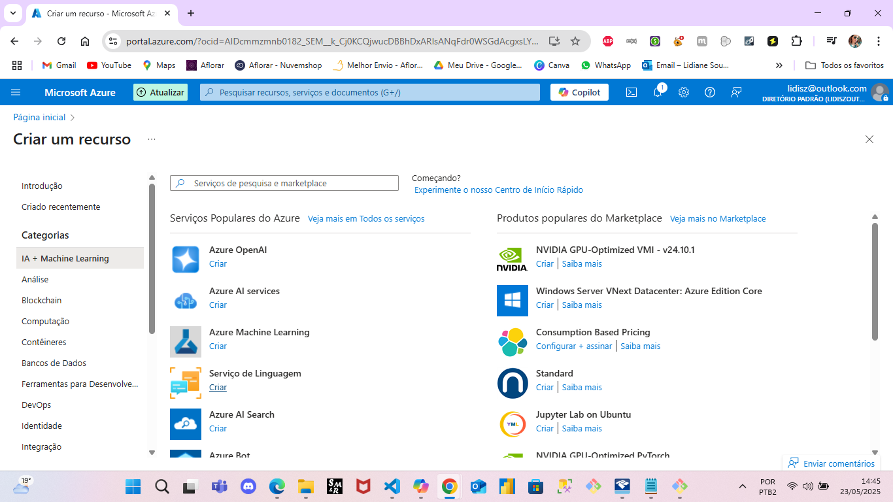
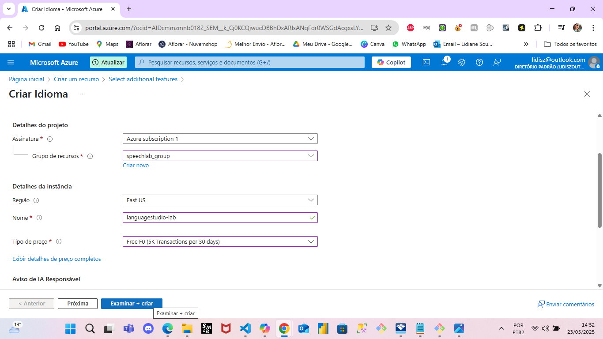
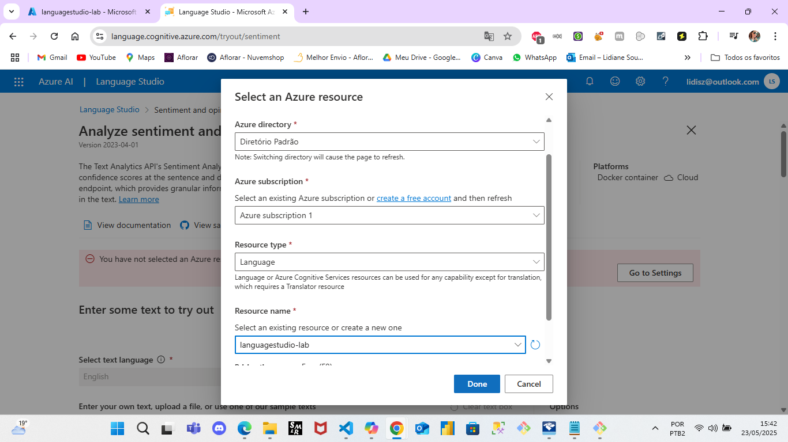
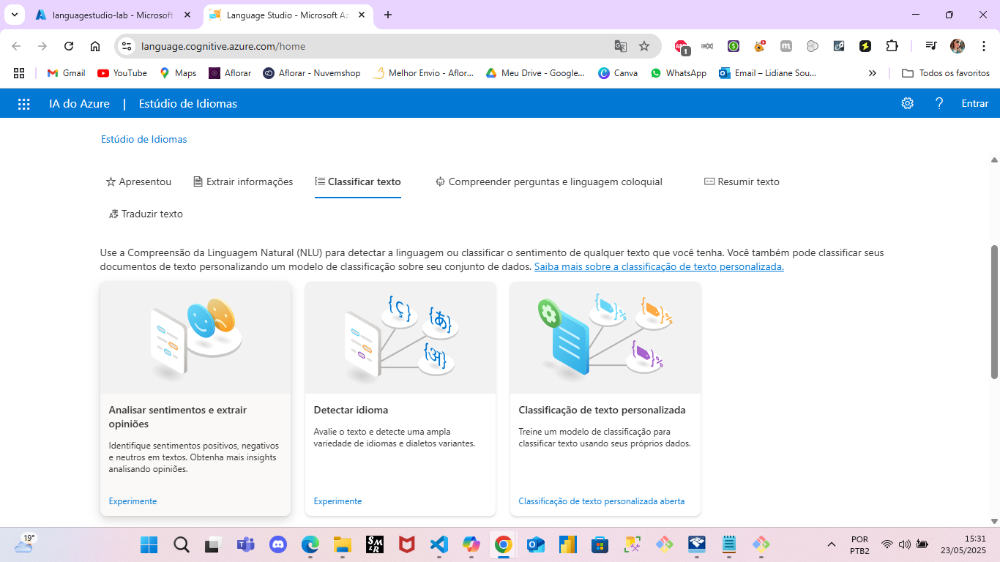
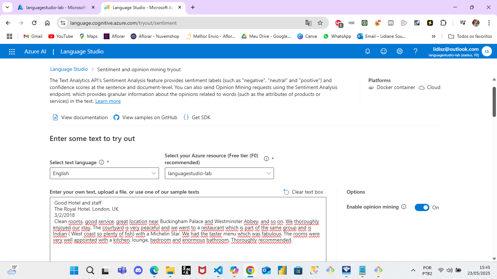
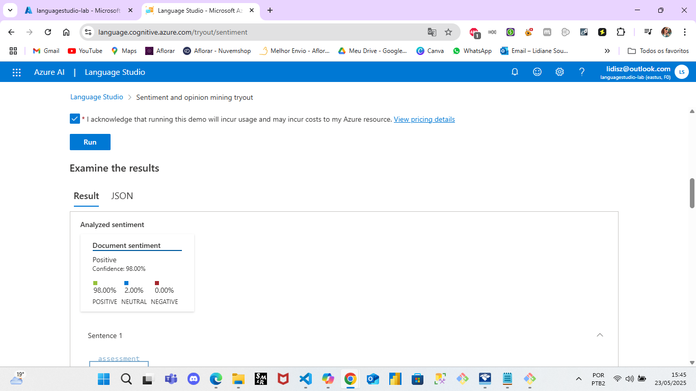
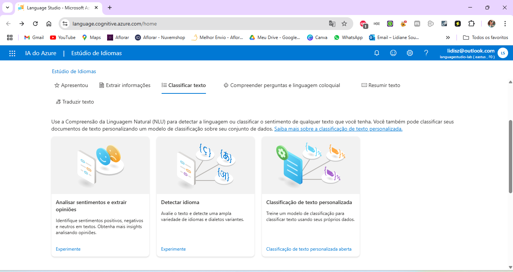
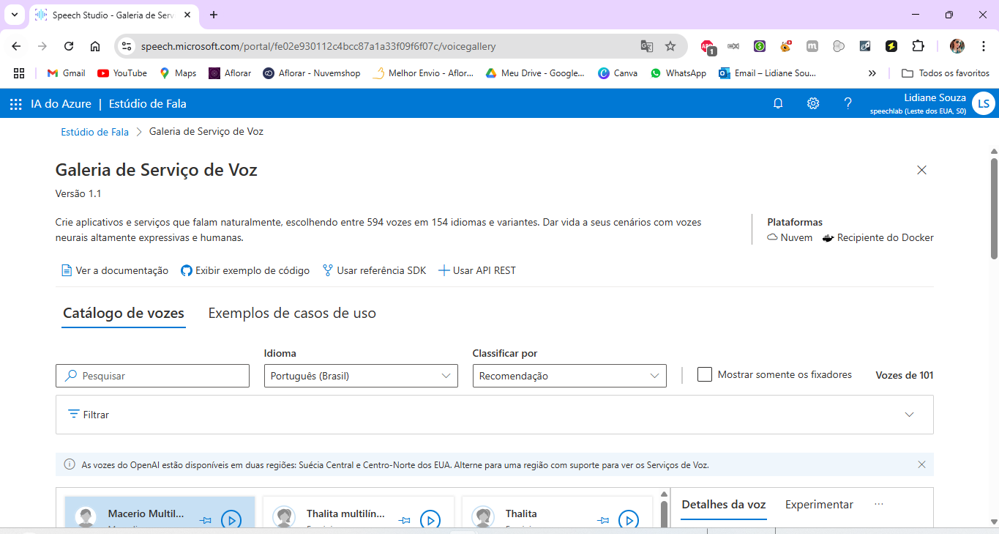
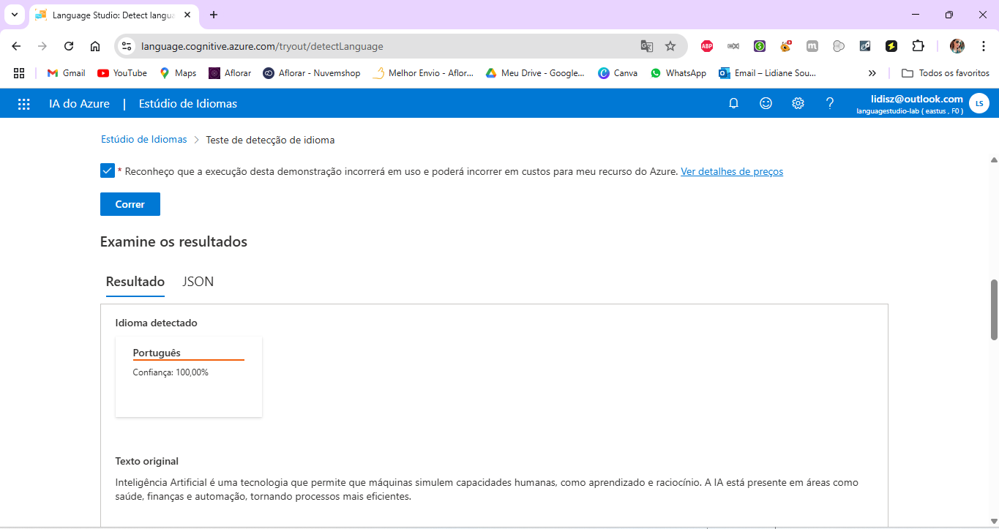

# 🧪 Laboratório Prático - Azure Speech e Language Studio

## 📝 Descrição
Este repositório contém anotações e experiências práticas com o uso do Azure Speech Studio e Language Studio, com o objetivo de explorar soluções baseadas em IA para voz e linguagem natural.

## 🎙️ Etapa 1: Azure Speech Studio

## 🎯 Objetivos da Etapa
- Explorar e testar as principais funcionalidades do Azure Speech Studio:
  - Conversão de fala em texto (speech-to-text)
  - Tradução de fala em tempo real
  - Geração de fala a partir de texto (text-to-speech)

## 🛠️ Ferramentas Utilizadas
- Azure Speech Studio
- Microsoft Azure Portal
- Áudio de exemplo da Microsoft Learn
- Áudio próprio sobre Inteligência Artificial

### ✅ O que foi feito
- Transcrição de áudio gravado (speech-to-text)
- Geração de fala a partir de texto (text-to-speech)
- Tradução de fala
- mais detalhes link insigts

### 💡 Insights
colocar link pasta insights

### 🖼️ Capturas de Tela
Veja a pasta `/images` para exemplos visuais da prática.

| Etapa | Descrição | Imagem |
|-------|-----------|--------|
| 1     | Acesso ao Speech Studio |  |
| 2     | Criação e configuração do recurso Speech no Azure |  |
| 3     | Interface da ferramenta de Conversão de Fala em Texto |  |
| 4     | Teste com áudio de exemplo da Microsoft e transcrição precisa |  |
| 5     | Teste com áudio próprio sobre IA e transcrição precisa |  |
| 6     | Acesso à ferramenta de Tradução de Fala no Speech Studio |  |
| 7     | Seleção dos idiomas: entrada em Português e saída em Inglês |  |
| 8     | Tradução bem-sucedida do áudio próprio sobre IA |  |
| 9     | Acesso à Galeria de Serviço de Voz no Speech Studio |  |
| 10    | Escolha do idioma (Português) e da voz, com uso de texto sobre IA |  |
| 11    | Reprodução e geração de fala com qualidade e naturalidade |  

---

## 🧠 Etapa 2: Azure Language Studio

## 🎯 Objetivos da Etapa
- Explorar funcionalidades do Azure Language Studio com foco em:
  - Análise de sentimentos
  - Análise de opiniões
  - Classificação de texto
  - Detecção de idioma

## 🛠️ Ferramentas Utilizadas
- Azure Language Studio
- Portal Azure (para criação e configuração dos recursos)
- Textos em português e inglês 

### ✅ O que foi feito
- Análise de sentimentos em textos curtos e longos.
- Detecção de Idiomas.
- mais detalhes link insigts

### 🖼️ Capturas de Tela
### 🖼️ Capturas de Tela – Azure Language Studio (Etapa 2)

| Etapa | Descrição                                                                                         | Imagem                                                                                             |
|-------|---------------------------------------------------------------------------------------------------|----------------------------------------------------------------------------------------------------|
| 1     | Acesso ao Azure para criação do recurso de Serviço de Linguagem (IA + Machine Learning)          |  |
| 2     | Seleção do grupo de recursos (mesmo da Etapa 1) e definição do nome                               |               |
| 3     | Acesso ao Language Studio e seleção do recurso criado no Azure                                    |          |
| 4     | Escolha da funcionalidade de Classificar Texto: Análise de Sentimentos e Extração de Opiniões |            |
| 5     | Análise de sentimento aplicada à opinião de um usuário (exemplo do Microsoft Learn)               |                  |
| 6     | Resultado da classificação da opinião com análise detalhada do sentimento (modelo pré-treinado)   |            |
| 7     | Acesso à ferramenta de detecção de idioma                                                         |   |
| 8     | Teste de detecção de idioma com texto sobre IA (utilizado na Etapa 1)                             |         |
| 9     | Resultado da detecção – idioma identificado corretamente como português                           |                  |

### 💡 Insights
colocar link pasta insights

links uteis

---

📌 Projeto desenvolvido como parte de um laboratório prático com foco em IA aplicada a voz e linguagem natural usando serviços do Microsoft Azure.
