# 🧪 Laboratório Prático - Azure Speech e Language Studio

## 📝 Descrição
Este repositório contém anotações e experiências práticas com o uso do Azure Speech Studio e Language Studio, com o objetivo de explorar soluções baseadas em IA para voz e linguagem natural.

## 🎙️ Etapa 1: Azure Speech Studio

### 🎯 Objetivos
- Praticar funcionalidades de reconhecimento e geração de fala usando o Speech Studio.
- Avaliar a qualidade da transcrição e síntese de fala.

### 🛠️ Ferramentas Utilizadas
- Azure Speech Studio
- Azure Portal (para criação de recursos)

### ✅ O que foi feito
- Transcrição de áudio gravado (speech-to-text)
- Geração de fala a partir de texto (text-to-speech)
- Tradução de fala

### 💡 Insights
colocar link pasta insights

### 🖼️ Capturas de Tela
Veja a pasta `/images` para exemplos visuais da prática.

| Etapa | Descrição | Imagem |
|-------|-----------|--------|
| 1     | Acesso ao Speech Studio | 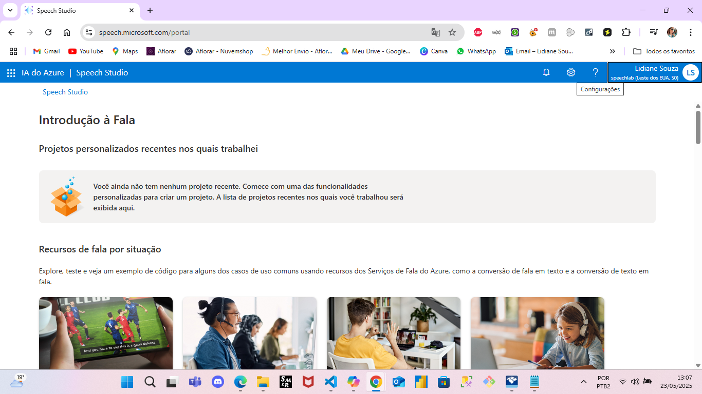 |
| 2     | Criação e configuração do recurso Speech no Azure | 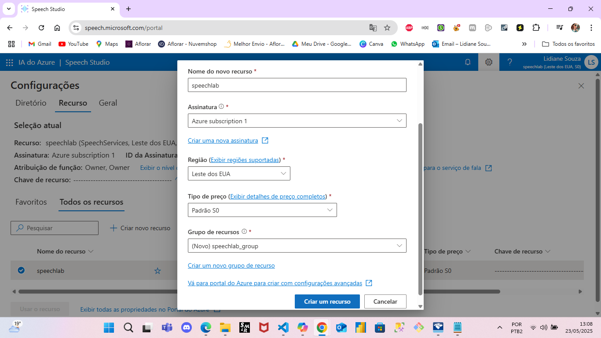 |
| 3     | Interface da ferramenta de Conversão de Fala em Texto | 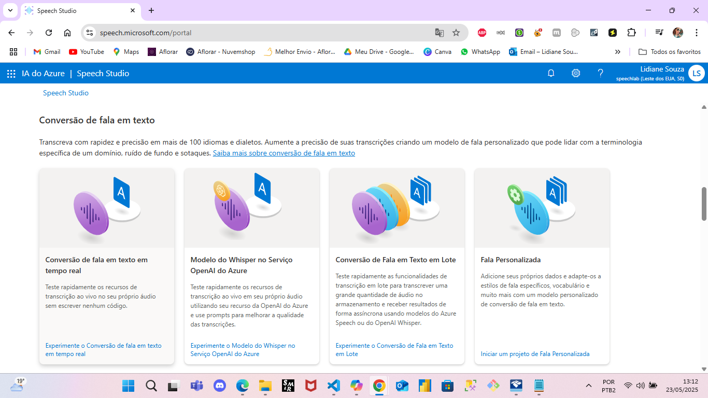 |
| 4     | Teste com áudio de exemplo da Microsoft e transcrição precisa | 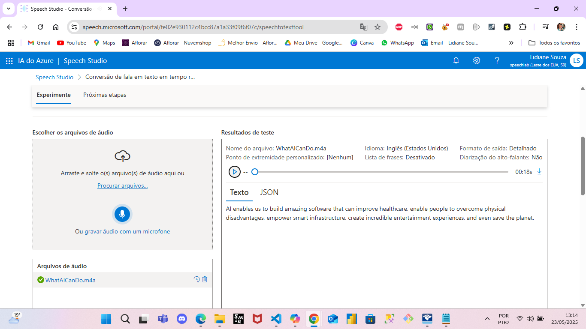 |
| 5     | Teste com áudio próprio sobre IA e transcrição precisa | 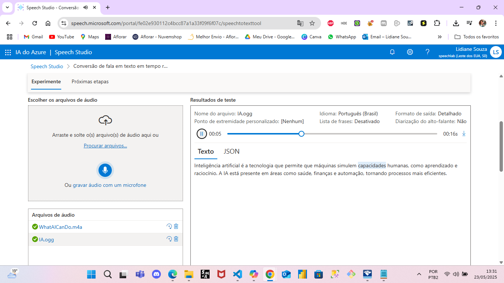 |
| 6     | Acesso à ferramenta de Tradução de Fala no Speech Studio | 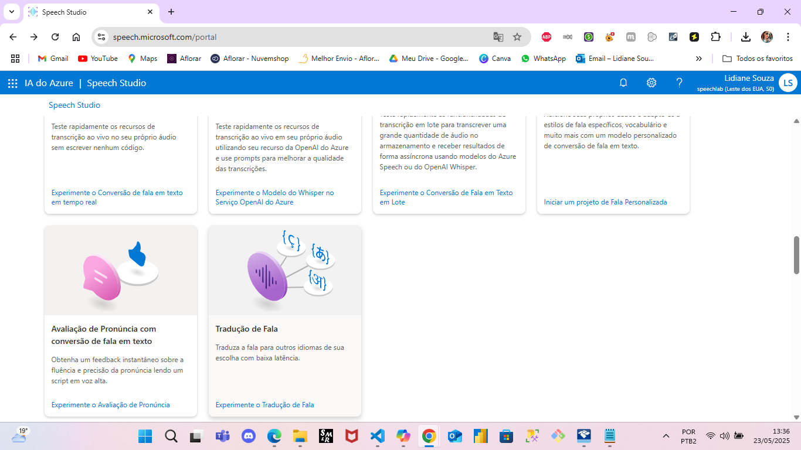 |
| 7     | Seleção dos idiomas: entrada em Português e saída em Inglês | 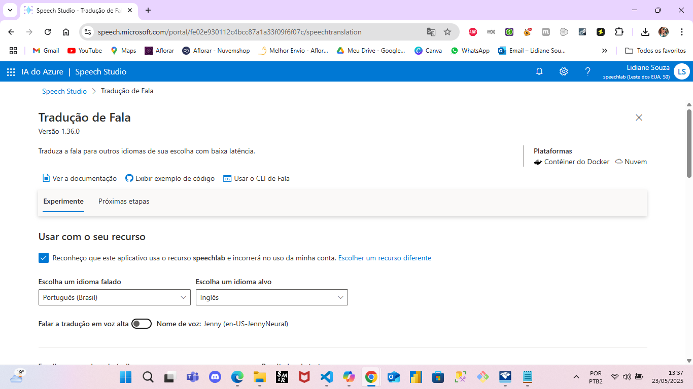 |
| 8     | Tradução bem-sucedida do áudio próprio sobre IA | 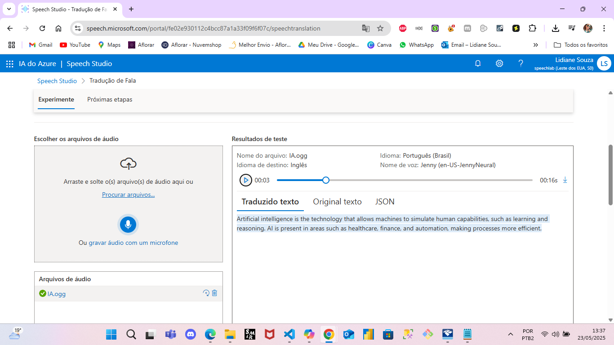 |
| 9     | Acesso à Galeria de Serviço de Voz no Speech Studio | 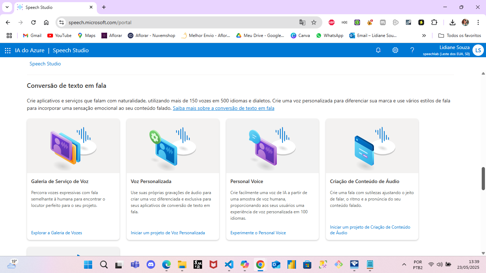 |
| 10    | Escolha do idioma (Português) e da voz, com uso de texto sobre IA | 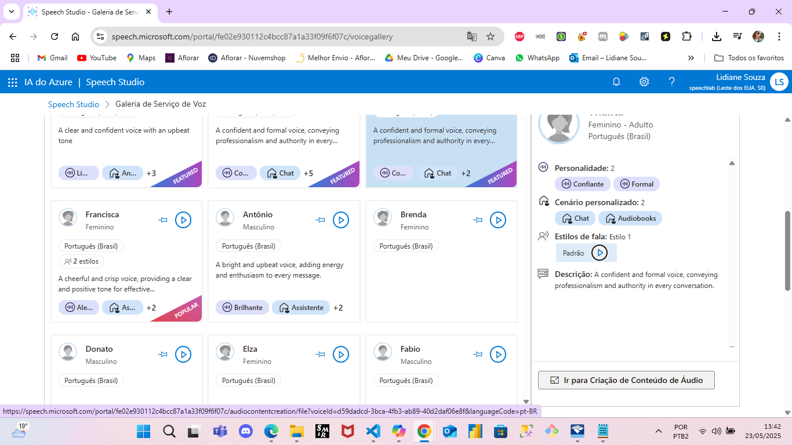 |
| 11    | Reprodução e geração de fala com qualidade e naturalidade | 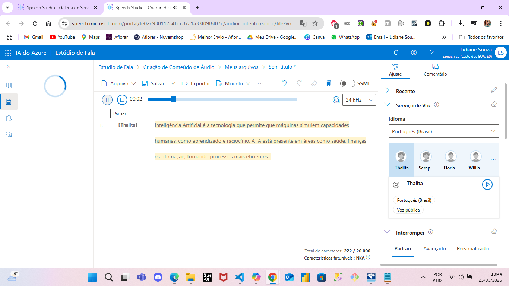 

---

## 🧠 Etapa 2: Azure Language Studio

### 🎯 Objetivos
- Explorar funcionalidades de análise de linguagem natural no Azure Language Studio.
- Praticar classificações de texto, análise de sentimentos, extração de entidades e linguagem personalizada.

### 🛠️ Ferramentas Utilizadas
- Azure Language Studio
- Azure Portal (mesmo grupo de recursos da Etapa 1)

### ✅ O que foi feito
- Análise de sentimentos em textos curtos e longos.
- Extração de entidades nomeadas (pessoas, locais, datas).
- Classificação de texto por categorias.
- Teste de modelos personalizados de linguagem (Custom Text Classification e NER).

### 🖼️ Capturas de Tela
Veja a pasta `/images` para exemplos visuais da prática.

### 💡 Insights
colocar link pasta insights

links uteis

---

📌 Projeto desenvolvido como parte de um laboratório prático com foco em IA aplicada a voz e linguagem natural usando serviços do Microsoft Azure.
